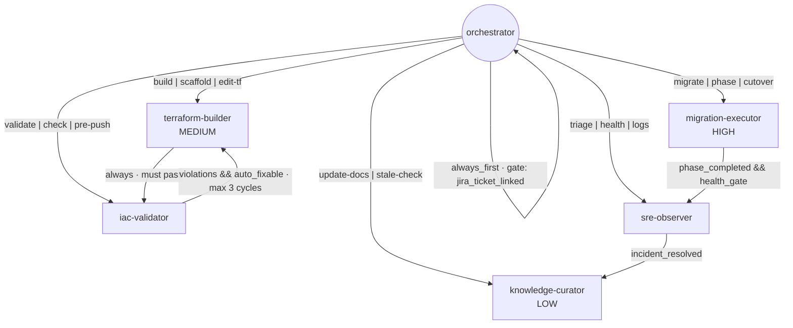
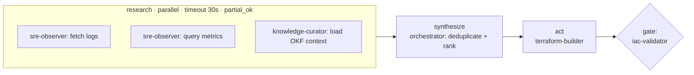

# Agent Graph

The agent graph is the core artifact of the bootstrap. `junction/graph_generator.py` turns discovery answers into an `agent-graph.yml` (schema version `2.0`, type `org`). A full generated example is in [examples/agent-graph.person.yml](examples/agent-graph.person.yml).

## The six nodes (zone defense)

The generator always emits six nodes. Each concern has exactly one owning node.

| Node | Role | Model tier | Zone (what it owns) | Tools | Risk gate |
|---|---|---|---|---|---|
| **orchestrator** | Dispatch + context assembly | planner | routing, context-loading, user-intent | read, search, ask-questions, runSubagent | none |
| **iac-validator** | Correctness gate | validator | naming, env-leak detection, reference integrity | read, search, grep, get-errors | none |
| **terraform-builder** | IaC code generation | builder | terraform files, module calls, variable wiring | read, edit, search, terminal, get-errors | **MEDIUM** |
| **sre-observer** | Post-deploy health + triage | observer | health checks, log analysis, metric queries | read, search, terminal, `mcp:aws-logs`, `mcp:newrelic` | none |
| **knowledge-curator** | OKF graph maintenance | curator | knowledge docs, cross-links, runbooks | read, edit, search | **LOW** |
| **migration-executor** | V1→V2 state machine | planner | migration state, phase gates, rollback | read, edit, search, terminal, `mcp:aws-logs` | **HIGH** |

Only the builder, curator and migration-executor can edit files. The validator and observer can't change anything, so a bug in either one can't damage the repo.

## Edges



| From | To | Trigger | Gate / limit |
|---|---|---|---|
| orchestrator | orchestrator | `always_first` | `jira_ticket_linked` (only when the Jira gate is on) |
| orchestrator | terraform-builder | `build \| scaffold \| edit-tf` | — |
| orchestrator | iac-validator | `validate \| check \| pre-push` | — |
| orchestrator | sre-observer | `triage \| health \| logs` | — |
| orchestrator | migration-executor | `migrate \| phase \| cutover` | — |
| orchestrator | knowledge-curator | `update-docs \| stale-check` | — |
| terraform-builder | iac-validator | `always` | must pass |
| iac-validator | terraform-builder | `violations && auto_fixable` | `max_cycles: 3` |
| sre-observer | knowledge-curator | `incident_resolved` | — |
| migration-executor | sre-observer | `phase_completed && health_gate` | — |

Three loops matter most:

- **Build ↔ validate.** Nothing the builder writes skips the validator. Auto-fixable violations go back to the builder for up to 3 cycles, and anything else escalates.
- **Observe → learn.** A resolved incident becomes curated knowledge (a runbook or cross-link), so the next triage starts from it.
- **Migrate → observe.** A migration phase counts as done only once the observer's health gate passes.

## Model tiers

When `model_optimization` is on, the generator assigns a model per tier:

| Tier | Used by | Default in generator |
|---|---|---|
| planner | orchestrator, migration-executor | `claude-opus-5` |
| builder | terraform-builder | `claude-opus-5` |
| validator | iac-validator | `claude-sonnet-5` |
| observer | sre-observer | `claude-sonnet-5` |
| curator | knowledge-curator | `claude-sonnet-5` |

Read-only and checking work runs on the cheaper tier, and reasoning-heavy planning and generation on the stronger one. With `model_optimization` off, every tier uses the strong model.

The defaults live in `junction/models.py`. Override any tier without code changes:

```bash
junction --discover --defaults --model validator=claude-haiku-4-5 --model builder=claude-fable-5-1
```

or set `models: {validator: claude-haiku-4-5}` in an answers file, or pass `generate_agent_graph(answers, models={...})`. Claude Code subagents get the family alias (`opus`, `sonnet`, `haiku`), so they keep tracking the latest model.

## Parallel fan-out / fan-in

With `parallel_research` on, the graph includes a three-phase pattern for triage and diagnosis:



Research runs in parallel and tolerates partial failure. Action happens exactly once, and it goes through the validator.

## Error handling and failure policy

```yaml
error_handling:
  decontamination:
    on_node_failure: snapshot context, isolate, do NOT carry forward
    on_retry: reload OKF fresh — never reuse stale context
    max_error_chain: 3
    after_max: hard reset — discard in-flight, escalate clean

failure_policy:
  default:   { retry: 3, backoff: exponential, fallback: escalate_to_human }   # retry: 0 when auto_fix_dv is off
  per_node:
    terraform-builder:  { retry: 3 }                                         # 1 when auto_fix_dv is off
    sre-observer:       { retry: 1, fallback: escalate with raw logs }
    migration-executor: { retry: 0, fallback: pause + human gate }
```

See [Governance, Safety and Evals](Governance-Safety-and-Evals.md) for the reasoning behind these values.

## `agent-graph.yml` top-level keys

| Key | Contents | Controlled by |
|---|---|---|
| `graph` | version, type, description (includes the domain) | `domain_name` |
| `naming` | resource-name pattern, env values, the single env variable | `naming_pattern`, `env_names` |
| `models` | per-tier model assignment | `model_optimization` (key omitted when off) |
| `nodes` | the six specialist agents | always emitted |
| `edges` | routing and hand-off edges | `jira_required` adds the self-gate |
| `parallel` | fan-out/fan-in pattern | `parallel_research` (key omitted when off) |
| `error_handling` | decontamination rules | always emitted |
| `failure_policy` | retries, backoff, fallbacks | `auto_fix_dv` tunes retries |
| `evals` | token budgets, costly patterns | always emitted |
| `governance` | Jira gate, knowledge scope, Terraform coding standards | `jira_required`, `env_names`, `naming_pattern` |

## Generating one

```python
from junction import generate_agent_graph, write_agent_graph  # write validates first

graph = generate_agent_graph({
    "domain_name": "person",
    "env_names": "dv,qc,pr",
    "naming_pattern": "dp-{env}-{domain}-{resource-type}-{purpose}",
    "jira_required": True,
    "auto_fix_dv": True,
    "parallel_research": True,
    "model_optimization": True,
})
write_agent_graph(graph, "agent-graph.yml")
```

Every key is optional. The defaults are the values above, with domain `platform`. `generate_agent_graph` validates the graph before returning it, and `write_agent_graph` refuses to write an invalid one.

## Schema validation

The Phase 1 gate, "agent graph config passes schema validation", is enforced in code. `junction/graph_schema.py` checks the graph against [`agent-graph.schema.json`](../../junction/schemas/agent-graph.schema.json) (JSON Schema 2020-12) and then against the safety invariants the schema can't express:

| Invariant | Why |
|---|---|
| All six nodes present, each reachable from the orchestrator | Zone defense only works if every zone has an owner |
| `iac-validator` and `sre-observer` have no `edit`/`write` tools | They're read-only by design |
| `migration-executor` is `HIGH` risk with `retry: 0` | Stateful cutovers pause for a human |
| `terraform-builder → iac-validator` has `gate: must pass`, and the fix loop has `max_cycles` | Nothing skips the validator, and loops terminate |
| The Jira gate edge matches `governance.jira_gate.enabled` | No half-configured ticket gate |
| `per_node_warn < per_node_hard <= per_work_graph_hard` | Budgets make sense |

```bash
junction --validate-graph .github/config/agent-graph.yml   # exit 0 = valid, 1 = lists every violation
```

## Rendered agents

Each node becomes one agent file for the chosen coding agent. Zone, tools, risk gate, model, skills and edges all come from the graph:

| Coding agent | Files | How edges and tools map |
|---|---|---|
| Copilot | `.github/agents/<node>.agent.md` | Out-edges become `handoffs`, and the orchestrator's `agents:` lists the five specialists. `terminal` → `execute`, and `mcp:aws-logs` → `cloud-logs/*` |
| Claude Code | `.claude/agents/<node>.md` | The orchestrator gets `Agent(<five specialists>)`. Read-only nodes get `disallowedTools: Edit, Write, NotebookEdit`, and `model:` is the tier's family alias |
| Cursor | `.cursor/rules/<node>.mdc` | Orchestrator `alwaysApply: true`. Builder and validator are scoped to `*.tf` globs |
| Continue | `.continue/rules/<node>.md` | Orchestrator always applied |
| Agnostic | `.agents/<node>.md` + `AGENTS.md` | Plain markdown briefs |

Next: [Discovery Engine](Discovery-Engine.md)
