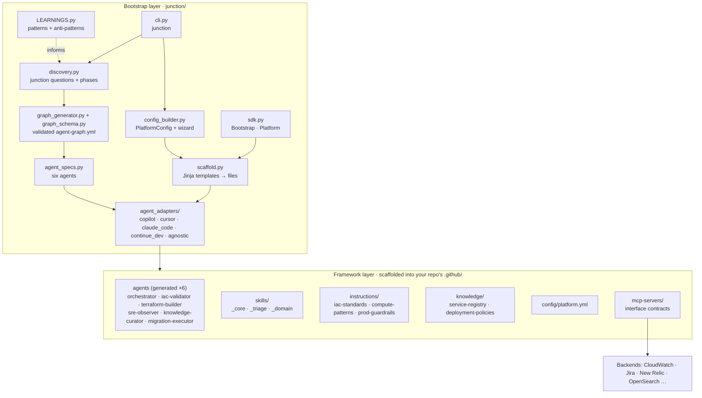

# Architecture and Repo Map

## Layers

## Bootstrap modules

| Module | Responsibility | Key API |
|---|---|---|
| `junction/discovery.py` | Discovery: 17 cloud-agnostic junction questions in 7 groups (incl. a use-case profile that presets later defaults), 7 gated phases, answers files, answers → platform | `run_discovery(prefilled, use_defaults)`, `load_answers()`, `build_platform_config()`, `print_implementation_plan()` |
| `junction/agent_discovery.py` | `--discover-with-agent`: local `claude` CLI (read-only) inspects the target repo and proposes discovery answers | `propose_answers_with_agent(target_dir)` |
| `junction/graph_generator.py` | Discovery answers → validated agent graph | `generate_agent_graph(answers, models)`, `write_agent_graph(graph, path)` |
| `junction/graph_schema.py` + `schemas/` | JSON Schema v2.0 + safety invariants | `validate_agent_graph()`, `graph_errors()`, `validate_agent_graph_file()` |
| `junction/models.py` | Model tier defaults and overrides | `DEFAULT_MODELS`, `resolve_models()`, `claude_code_alias()` |
| `junction/agent_specs.py` | The six graph agents: operating instructions + rendered bodies | `build_agent_specs(graph)`, `render_agent_body()` |
| `junction/LEARNINGS.py` | Production knowledge used to shape questions and defaults | `DRIFT_PREVENTION_PATTERNS`, `HIGH_VALUE_JUNCTION_QUESTIONS`, `DETECTED_ANTI_PATTERNS` |
| `junction/config_builder.py` | Canonical `PlatformConfig`, env/MCP config, interactive wizard | `PlatformConfig.from_dict/from_yaml/from_answers`, `interactive_build()` |
| `junction/scaffold.py` | Render templates, collect and write files (framework content is read from the packaged `junction/framework/`) | `collect_files(platform, graph, answers)`, `write_files()` |
| `junction/agent_adapters/` | Render the six agents for a specific coding agent | `get_adapter(agent).generate_files(platform, graph)` |
| `junction/sdk.py` | Programmatic facade | `Platform`, `Bootstrap(platform, graph=…)`, `Bootstrap.from_discovery()`, `.validate/.dry_run/.run` |
| `junction/cli.py` | Click entry point | `junction` (`--discover`, `--defaults`, `--answers`, `--model`, `--validate-graph`) |
| `junction/templates/` | Jinja templates | `platform.yml.j2`, `mcp_json.j2`, `env_example.j2` |

## Framework files (what agents read at runtime, once scaffolded)

These are copied verbatim from `junction/framework/` (kept in sync with this repo's own `.github/`
by `scripts/sync_framework.py`) into every target repo:

| Path | Purpose |
|---|---|
| `.github/skills/_core/self-healing-deploy/` | Deploy → health gate → monitor → fix/rollback → learn state machine |
| `.github/skills/_core/post-push-monitor/` | CI closed loop after every push (≤3 auto-fixes) |
| `.github/skills/_core/env-promotion/` | Safe cross-env promotion, no env-specific value copying |
| `.github/skills/_core/drift-detection/` | Env-vs-env diff classified by intent |
| `.github/skills/_core/knowledge-curation/` | Runbooks from resolved incidents, stale checks (knowledge-curator) |
| `.github/skills/_core/v1-v2-migration/` | Gated V1 → V2 migration state machine with rollback (migration-executor) |
| `.github/config/agent-graph.yml` | The six-agent graph (generated, schema v2.0) |
| `.github/skills/_triage/iac-triage/` | Plan/apply failure classification |
| `.github/skills/_triage/sre-log-fetching/` | On-demand log retrieval |
| `.github/skills/_domain/_TEMPLATE.md` | Starter for your own domain skills |
| `.github/instructions/*.instructions.md` | Guardrails: IaC standards, compute patterns, prod guardrails |
| `.github/knowledge/*.md` | OKF: service registry, deployment policies |
| `.github/config/platform.yml` | Master config: envs, risk tiers, compute, streaming, MCP |
| `.github/mcp-servers/README.md` | Stable tool interfaces for swappable backends |

## How the graph maps to agent files

Bootstrap renders **one agent file per graph node**. The graph is the single source of truth, and `agent_specs.py` adds each agent's operating instructions:

| Graph node | Copilot | Claude Code | Skills |
|---|---|---|---|
| orchestrator | `orchestrator.agent.md` (hands off to all five) | `orchestrator.md` + `CLAUDE.md` (the main session orchestrates) | env-promotion, drift-detection |
| iac-validator | `iac-validator.agent.md` | `iac-validator.md` (read-only) | drift-detection, iac-triage |
| terraform-builder | `terraform-builder.agent.md` (handoff → validator) | `terraform-builder.md` | self-healing-deploy, post-push-monitor |
| sre-observer | `sre-observer.agent.md` (`cloud-logs/*`, `observability/*`) | `sre-observer.md` (read-only, `mcp__cloud-logs`, `mcp__observability`) | sre-log-fetching, iac-triage |
| knowledge-curator | `knowledge-curator.agent.md` | `knowledge-curator.md` | knowledge-curation |
| migration-executor | `migration-executor.agent.md` (handoff → observer) | `migration-executor.md` + `/migrate` | v1-v2-migration |
