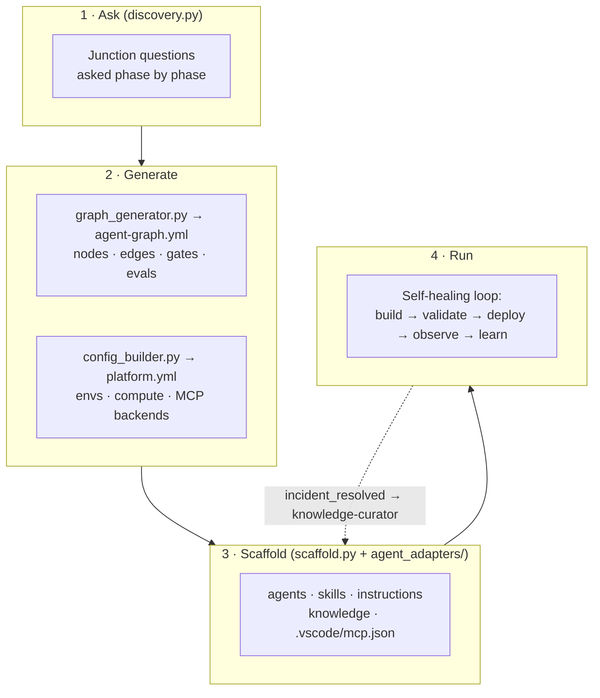

# The Bootstrap Idea

## The problem with "one assistant in the repo"

Give a single general-purpose coding assistant an infrastructure repo and a vague task, and the same failures show up over and over. The framework's authors saw them while scaffolding a 15-service ECS + MSK + Aurora platform (see [Production Learnings](Production-Learnings.md)):

| Symptom | What went wrong |
|---|---|
| Legacy names (`dp-com`, `d1`, `u1`, `p1`) left in the new repo | Nothing checked the naming standard; 28 stale references were in the first draft |
| Retries fail the same way three times | The agent retried with the context that caused the failure |
| One request reads 74K tokens | The agent scanned the whole workspace when two index reads would have been enough |
| Stakeholders confused by five partial Jira updates | The agent posted "starting work…" and progress notes before anything was deployed |
| Adding a service destroys unrelated resources | `count` was used where `for_each` was needed, and nobody asked early enough |

None of these is a model-quality problem. They come from **structure**: who is allowed to do what, when a decision gets made, and which context carries into the next step.

## The idea: engineer the agent organization, then generate it

**Graph agent engineering** treats the AI setup of an IaC repo as an org chart that you design and version:

1. **Specialist nodes, not one generalist.** Six agents, each with a *zone* (what it owns), a *tool list* (what it can touch), a *model tier* (how much reasoning it needs) and a *risk gate* (how much autonomy it has). This is the **zone-defense** pattern: every concern has exactly one owner.
2. **Explicit edges.** Hand-offs are declared, not improvised. For example, `terraform-builder → iac-validator` fires on every build and must pass, and `iac-validator → terraform-builder` fires for auto-fixable violations, for at most 3 cycles.
3. **Gates on the edges.** A Jira ticket must be linked before the orchestrator routes anything. HIGH-risk work (the migration executor) never auto-retries, and it pauses at a human gate instead.
4. **Durable knowledge, not story state.** Agents navigate an Organizational Knowledge Framework (OKF) index of platform facts (services, architecture, runbooks, contracts, policies). Ticket progress and migration status stay out of it.
5. **Decontamination on failure.** A failed node's context is snapshotted and isolated. A retry reloads knowledge fresh, and after 3 chained errors in-flight work is discarded and the task escalates cleanly.

**Bootstrap** is the part that makes this repeatable. A discovery engine asks the questions that shape the graph *at the junction where they matter*. Then it generates `agent-graph.yml` and `platform.yml` and scaffolds agents, skills, instructions, knowledge and MCP wiring into any repo, for any supported coding agent.

## Design principles

| Principle | How it shows up |
|---|---|
| **Decide early, at the right junction** | Naming standard and the single `var.environment` are locked in Phase 0, before any `.tf` file exists. Secrets strategy is asked in Phase 4, when env vars are wired. |
| **Correct by default** | The generated graph always has the validator gate, the decontamination policy and token budgets. Discovery answers only tune them (retries, Jira gate, parallel research, model tiers). |
| **Least privilege per node** | The SRE observer is read-only. Only builder, curator and migration-executor have `edit`. Only the migration-executor is HIGH risk. |
| **Cheap where it can be** | Validators, observers and curators run on a cheaper model tier. Planning and building use the stronger tier. |
| **Parallel research, single action** | Fan out (logs, metrics and knowledge in parallel, 30 s timeout, partial results OK), fan in at the orchestrator to deduplicate and rank, then act once through the validator gate. |
| **Agent-agnostic output** | The same design is rendered as Copilot `.agent.md`, Cursor `.mdc` rules, Claude Code `CLAUDE.md` + slash commands, Continue config, or a plain `AGENTS.md`. |
| **Report only confirmed outcomes** | Jira is updated only on confirmed completion with SRE metrics, never with partial progress. |

## What you get

After bootstrap, a repo has:

- an **agent graph** (`agent-graph.yml`) describing six specialist nodes, their edges, gates, failure policy and evals
- a **platform config** (`.github/config/platform.yml`): environment chain, risk tiers, compute, streaming, MCP backends
- **agents and skills** for the chosen coding agent: IaC Env Manager, SRE Observer, self-healing deploy, env promotion, drift detection, post-push monitor, IaC triage, log fetching
- **guardrail instructions**: IaC standards, compute patterns, prod guardrails
- a **knowledge base**: service registry and deployment policies
- **MCP wiring** for cloud logs, issue tracker, observability and log aggregation
- a **phased plan** from design to first agent-built service

Next: [Agent Graph](Agent-Graph.md)
