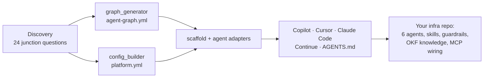

# Graph Agent Engineering for IaC + SRE — Wiki

> **The bootstrap idea in one sentence:** instead of dropping one general-purpose AI assistant into an infrastructure repo, ask a short set of *junction questions* once, then generate a **graph of specialist agents** — each with its own zone, tools, model and risk gate — plus the guardrails, knowledge base and phased build plan that keep them from drifting.

This wiki documents the bootstrap layer of the
[Junction](../../README.md) (`junction` v0.3): what the idea is, how the agent graph is shaped, how discovery works, and the production lessons built into it.

## Start here

| If you want to… | Read |
|---|---|
| Understand the idea and why it's a graph | [The Bootstrap Idea](Bootstrap-Idea.md) |
| See the six agents, their edges and the `agent-graph.yml` schema | [Agent Graph](Agent-Graph.md) |
| Know which questions the bootstrap asks, and why then | [Discovery Engine](Discovery-Engine.md) |
| Follow the build from empty repo to first agent-built service | [Implementation Phases](Implementation-Phases.md) |
| Review risk tiers, gates, failure policy and token budgets | [Governance, Safety and Evals](Governance-Safety-and-Evals.md) |
| Learn the anti-patterns the framework prevents | [Production Learnings](Production-Learnings.md) |
| Install and run it | [Getting Started](Getting-Started.md) |
| Map the idea to files in this repo | [Architecture and Repo Map](Architecture-and-Repo-Map.md) |
| See what's done and what's still open | [Roadmap and Open Items](Roadmap-and-Open-Items.md) |

## The idea at a glance

## Key numbers

| | |
|---|---|
| Specialist agent nodes | **6**: orchestrator, iac-validator, terraform-builder, sre-observer, knowledge-curator, migration-executor |
| Graph edges | **9** routing and hand-off edges, plus an optional Jira self-gate |
| Junction questions | **24**, in 6 groups: platform, discovery, naming, data stores, agent graph, secrets |
| Implementation phases | **7** (0–6), each ending at a gate |
| Encoded drift-prevention patterns | **8**, plus 4 anti-patterns found in production |
| Supported coding agents | **5**: `copilot`, `cursor`, `claude-code`, `continue`, `agnostic`. Each gets all six agents in its native format |
| Schema | `agent-graph.yml` v2.0 is validated (JSON Schema + safety invariants) on every write and with `--validate-graph` |

A one-page presentation of this idea lives alongside this wiki: see [`docs/presentation/`](../presentation/README.md).
