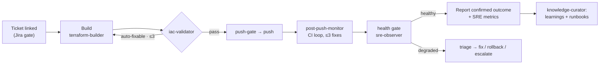

# Implementation Phases

The bootstrap doesn't generate a whole platform in one pass. It follows **seven phases** (`IMPLEMENTATION_PHASES` in `junction/discovery.py`). Each phase has declared outputs and ends at a **gate** that must hold before the next one starts. Junction questions are asked at the phase that needs them.

```mermaid
flowchart LR
    P0["0 · Discovery + Design"] -->|"user confirms design"| P1["1 · Scaffold Agent Graph"]
    P1 -->|"graph passes schema validation"| P2["2 · Store Layer"]
    P2 -->|"terraform validate passes"| P3["3 · Platform Layer"]
    P3 -->|"module interfaces validated"| P4["4 · Service Layer"]
    P4 -->|"env var parity vs V1"| P5["5 · MCP + DevContainer"]
    P5 -->|"MCP servers start clean"| P6["6 · Evals + First Test"]
    P6 -->|"evals PASS · validator approves"| Done(["Agent-operated repo"])
```

| # | Phase | What happens | Outputs | Gate | Questions asked |
|---|---|---|---|---|---|
| 0 | **Discovery + Design** | Ask questions, lock naming, confirm the architecture | `platform.yml`, `agent-graph.yml`, `naming-standard.md` | User confirms the design decisions | discovery, naming |
| 1 | **Scaffold Agent Graph** | Create agents, skills, instructions and knowledge structure | 6 agents, 8 skills, 3 instructions, OKF knowledge dirs | Agent graph config passes schema validation | agent_graph |
| 2 | **Build Store Layer** | Stateful resources (Aurora, MSK, S3) with KMS | `store-aurora.tf`, `store-msk.tf`, `store-s3.tf` | `terraform validate` passes | data_stores, secrets |
| 3 | **Build Platform Layer** | ECS cluster, `for_each` services, IAM, ALB, log groups | `platform-ecs*.tf`, `platform-kms.tf`, `platform-vpc.tf` | Module interface validation: modules cloned and outputs checked | — |
| 4 | **Build Service Layer** | Per-service env vars, secrets, IAM policies | `service-*.tf`, Secrets Manager resources | Env-var parity confirmed against the running V1 (if migrating) | secrets |
| 5 | **MCP + DevContainer** | Wire MCP servers and a devcontainer for local plan | `.vscode/mcp.json`, `.devcontainer/`, MCP `server.py` files | MCP servers start without errors | — |
| 6 | **Evals + First Test** | Run evals, then give the graph a real task | `evals.log`, the first service added through the agent graph | Evals PASS, the agent produces valid TF and the IaC Validator approves | — |

## Why this order

- **Design before code.** Naming and the single environment variable are the most expensive things to change later, so Phase 0 exists only to lock them.
- **Agents before infrastructure.** From Phase 2 on, the graph builds the infrastructure itself: the builder writes it and the validator gates it. The phases also test the org.
- **Store → platform → service.** Stateful resources come first because platform and service layers reference them (KMS keys, SG rules, connection details).
- **Validate module interfaces, don't guess.** Phase 3 clones modules and checks that their outputs exist before calling them, which avoids debugging `output not found` blind.
- **Parity before cutover.** When migrating, Phase 4 compares env vars against the running V1 before anything replaces it.
- **Prove it with a real task.** Phase 6 isn't done until the graph has added a service end to end and passed its own evals.

## Runtime loop after bootstrap

Once the phases finish, day-to-day work follows the self-healing loop built into the core skills:

Next: [Governance, Safety and Evals](Governance-Safety-and-Evals.md)
